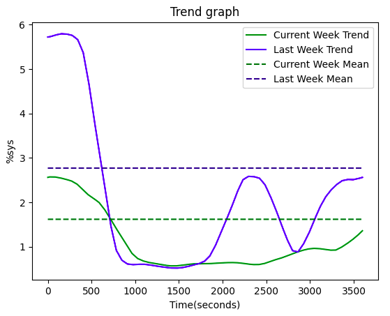
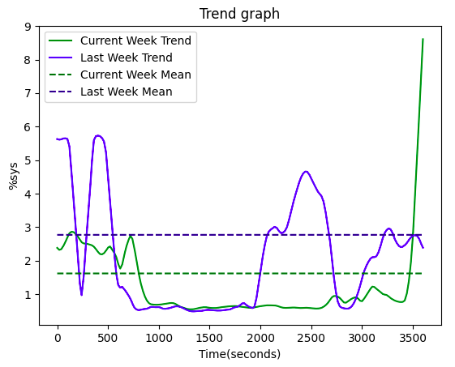

# Weekly Summary of Performance
## Trend Plot:
Plots trends of mentioned variable and its average over two consecutive weeks, thus helping the user to visually compare performance with previous week.

* **URL** 
 	`/trend.png`
* **URL Params**
    - Required:
        - datafile  - CSV and JSON formats are accepted
        - label - data label on which report is to be generated
    - Optional:
        - execspeed = [alphabet]      Speed of graph generation. 
            - “slow” 
            - “fast” are allowed options.  _default_ 
        - trendtype = [alphabet]            Smoothness of trend plot. 
            - “smooth”  _default_
            - “rough” are allowed values.
        - zoom = [integer]           Zoom feature for the graph
            - 0 _default_ - normal graph
            - 1 - graph supporting zoom  
 

## Weekly Performance Report:
* **URL** 
 	`/summary`
* **URL Params**
    - Required:
        - datafile  - CSV and JSON formats are accepted
        - label - data label on which report is to be generated
    - Optional:
        - execspeed = [alphabet]      Speed of graph generation. 
            - “slow” 
            - “fast” are allowed options.  _default_ 
        - trendtype = [alphabet]            Smoothness of trend plot. 
            - “smooth”  _default_
            - “rough” are allowed values.
        - zoom = [integer]           Zoom feature for the graph
            - 0 _default_ - normal graph
            - 1 - graph supporting zoom  
        - output         format in which report is to be outputted
            - “json”  _default_
            - “html”
 * **Output**
    - json format
        {
            "curWeekStat": {
                        "25%": 1.99, 
                        "50%": 13.37, 
                        "75%": 18.41, 
                        "count": 604800.0, 
                        "max": 77.41, 
                        "maxIndex": 606342.0, 
                        "mean": 12.479267113094233, 
                        "min": 0.0, 
                        "minIndex": 614079.0, 
                        "std": 10.73124627465345
            },   
            "label": "%usr",  
            "lastWeekStat":     {"25%": 1.99,  "50%": 13.75,   "75%": 18.41,   "count": 604800.0,   "max": 77.41,  "mean": 12.5205738260573,   "min": 0.0,   "std": 10.685182148682792  },   
            "negAffectors":    [["%idle", -0.920078059280334, -0.9198306067804806 ]],   
            "posAffectors":     [["%sys", 0.8597380031704872, 0.8576699089279437]],   
            "trendPlotURL":    "/trend.png?label=%idle&datafile=cpudata1.csv"
}
    - html format
    
