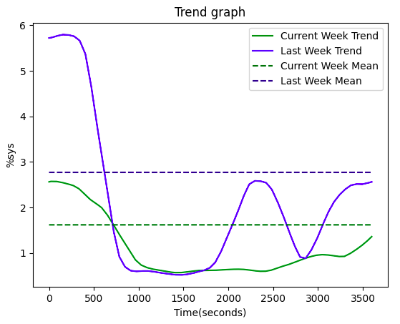
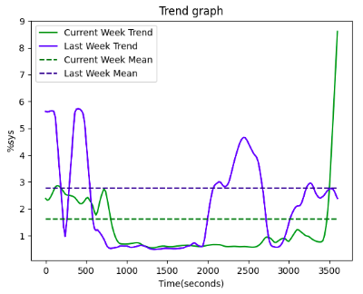
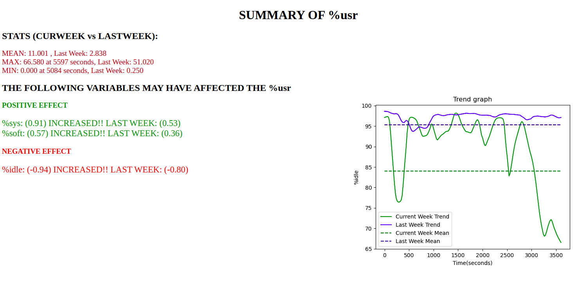

# Weekly Summary of Performance
## Trend Plot:
Plots trends of mentioned variable and its average over two consecutive weeks, thus helping the user to visually compare performance with previous week.

* **URL** 
 	`/trend.png`
* **URL Params**
    - Required:
        - datafile  : CSV and JSON formats are accepted
        - label : Data label on which report is to be generated
    - Optional:
        - execspeed = [alphabet]  :  Speed of graph generation
            - “slow” 
            - “fast”  _default_ 
        - trendtype = [alphabet]  :      Smoothness of trend plot 
            - “smooth”  _default_
            - “rough”
        - zoom = [integer]   :  Zoom feature for the graph
            - 0 _default_ - simple plot
            - 1 - plot supporting zoom  

>Example URL : 
http://127.0.0.1:5000/summary?label=%sys&datafile=cpudata1.csv&zoom=0&output=html&execspeed=fast&trendtype=smooth

 

## Weekly Performance Report:
* **URL** 
 	`/summary`
* **URL Params**
    - Required:
        - datafile  : CSV and JSON formats are accepted
        - label : Data label on which report is to be generated
    - Optional:
        - execspeed = [alphabet]  :  Speed of graph generation
            - “slow” 
            - “fast”  _default_ 
        - trendtype = [alphabet]  :      Smoothness of trend plot
            - “smooth”  _default_
            - “rough”
        - zoom = [integer]   :  Zoom feature for the graph
            - 0 _default_ - simple plot
            - 1 - plot supporting zoom  
        - output = [alphabet]  :      Format in which report is to be outputted
            - “html”  _default_
            - “json”

>Example URL : 
http://127.0.0.1:5000/summary?label=%sys&datafile=cpudata1.csv&zoom=0&output=html&execspeed=fast&trendtype=smooth

 **Sample Output**
     - **html format**
    

     - **json format**
        { 
            "curWeekStat": {  
                  "25%": 1.99,   "50%": 13.37,   "75%": 18.41,   "count": 4800.0,   "max": 77.41,   "maxIndex": 342.0,   "mean": 12.479,    
                  "min": 0.0,   "minIndex": 4079.0,   "std": 10.7312   
            },   
            "label":  "%usr",  
            "lastWeekStat": {  
                  "25%": 1.99,  "50%": 13.75,   "75%": 18.41,   "count": 4800.0,   "max": 77.41,  "mean": 12.52,  "min": 0.0,   "std": 10.685 
           },   
            "negAffectors":   [["%idle", -0.920078059280334, -0.9198306067804806 ]],   
            "posAffectors":    [["%sys", 0.8597380031704872, 0.8576699089279437]],   
            "trendPlotURL":   "/trend.png?label=%idle&datafile=cpudata1.csv" 
}
   